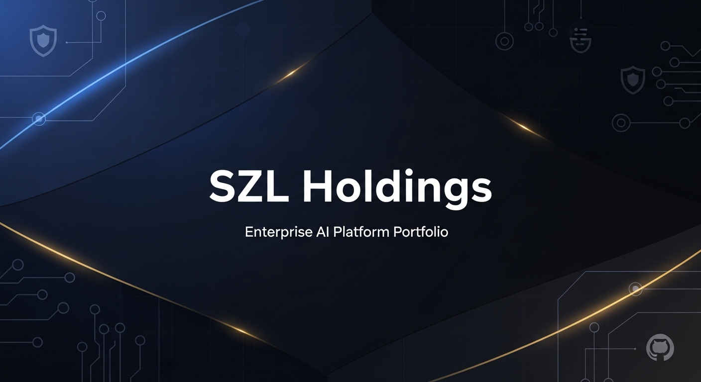
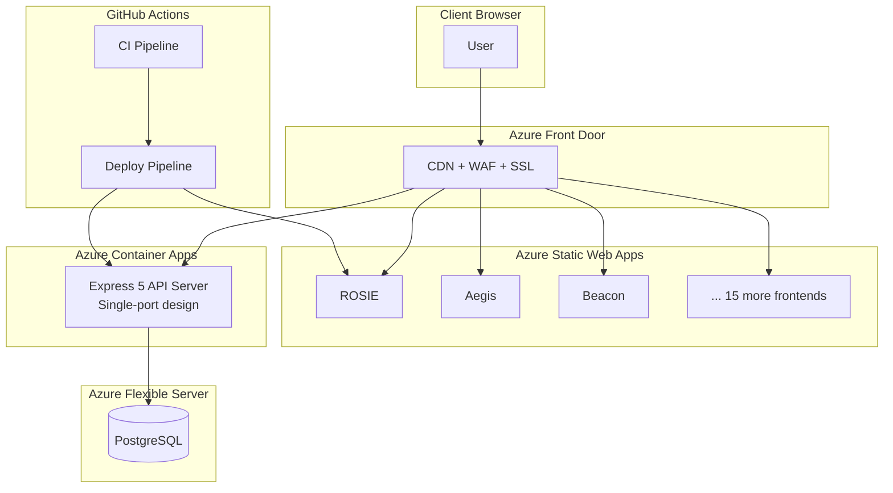

<p align="center">
  
</p>

<h1 align="center">SZL Holdings</h1>
<p align="center"><strong>Enterprise AI platform portfolio — 20 apps spanning intelligence, security, maritime, observability & consulting</strong></p>

<p align="center">
  <a href="https://github.com/stephenlutar2-hash/szl-holdings/actions/workflows/ci.yml"></a>
  <a href="https://github.com/stephenlutar2-hash/szl-holdings/actions/workflows/deploy.yml"></a>
  
  
  
  
  <a href="https://szlholdings.com"></a>
  
</p>

---

## Featured Apps

<table>
<tr>
<td width="33%" valign="top">

### 🔬 INCA Intelligence Platform
AI-powered intelligence collection and analysis platform with real-time threat assessment, entity extraction, and geospatial mapping for actionable insights.

</td>
<td width="33%" valign="top">

### 🚢 Vessels Maritime Intelligence
Maritime domain awareness system with AIS vessel tracking, port analytics, route optimization, and compliance monitoring for global shipping operations.

</td>
<td width="33%" valign="top">

### ⚡ Lyte
Unified communications and workflow orchestration hub connecting teams, tasks, and tools under a single lightning-fast interface.

</td>
</tr>
<tr>
<td width="33%" valign="top">

### 🛡️ Aegis Security Suite
Enterprise defensive security platform with vulnerability management, threat detection, compliance dashboards, and import center for security data feeds.

</td>
<td width="33%" valign="top">

### 🏢 SZL Holdings Corporate
Premium corporate site and venture platform showcasing the SZL Holdings portfolio, services, and strategic partnerships.

</td>
<td width="33%" valign="top">

### 💼 Carlota Jo Consulting
Strategic advisory and portfolio management platform for Carlota Jo Consulting — executive consulting, deal flow, and client engagement.

</td>
</tr>
</table>

---

## Complete App Catalog

| # | App | Path | Status | Description | Key Tech |
|---|-----|------|--------|-------------|----------|
| 1 | **ROSIE** | `/` | Production | AI security monitoring command center | React, TanStack Query, Framer Motion |
| 2 | **Aegis** | `/aegis/` | Production | Enterprise defensive security suite | React, Recharts, Wouter |
| 3 | **Beacon** | `/beacon/` | Production | Telemetry dashboard for KPIs and project metrics | React, Framer Motion, Recharts |
| 4 | **Lutar** | `/lutar/` | Production | Environmental impact and sustainability tracking | React, Data Viz, Drizzle |
| 5 | **Nimbus** | `/nimbus/` | Production | Predictive AI analytics with confidence scoring | React, TanStack Query, ML |
| 6 | **Firestorm** | `/firestorm/` | Beta | Security simulation lab for defensive strategy testing | React, Canvas, Simulation |
| 7 | **DreamEra** | `/dreamera/` | Beta | AI storytelling and artifact mapping engine | React, AI Generation, Canvas |
| 8 | **Dreamscape** | `/dreamscape/` | Beta | Creative world explorer with prompt studio and artifact gallery | React, 3D, Generative AI |
| 9 | **Zeus** | `/zeus/` | Production | Modular core architecture backbone | React, Module Federation |
| 10 | **Apps Showcase** | `/apps-showcase/` | Production | Public portfolio showcase with project catalog | React, Vite |
| 11 | **Readiness Report** | `/readiness-report/` | Production | Operational readiness assessment dashboards | React, Assessment Engine |
| 12 | **Career** | `/career/` | Production | Personal portfolio and career highlights | React, Framer Motion |
| 13 | **Vessels** | `/vessels/` | Production | Maritime intelligence and AIS vessel tracking | React, Maps, Real-time Data |
| 14 | **INCA** | `/inca/` | Production | Intelligence collection & analysis platform | React, NLP, Geospatial |
| 15 | **Lyte** | `/lyte/` | Production | Communications and workflow orchestration | React, WebSockets, TanStack |
| 16 | **Carlota Jo** | `/carlota-jo/` | Production | Strategic advisory & portfolio management | React, Tailwind, Vite |
| 17 | **SZL Holdings** | `/szl-holdings/` | Production | Premium corporate innovation & venture platform | React, Tailwind, Framer Motion |
| 18 | **AlloyScape** | `/alloyscape/` | Production | Workflow orchestration with connectors and execution logs | React, Dag Visualization |
| 19 | **Mockup Sandbox** | — | Internal | Development sandbox for rapid UI prototyping | React, Hot Reload |
| 20 | **API Server** | `/api/*` | Production | Express 5 unified API serving all frontends + REST routes | Express 5, Drizzle, PostgreSQL |

---

## Tech Stack

<p align="center">
  
</p>

| Layer | Technology |
|-------|-----------|
| **Frontend** | React 19, TypeScript 5.9, Vite, Tailwind CSS, Framer Motion, Recharts, TanStack Query |
| **Backend** | Express 5, Node.js 22, Drizzle ORM, Zod validation |
| **Database** | PostgreSQL (Azure Flexible Server) |
| **Infrastructure** | Azure Container Apps, Azure Front Door, Azure Static Web Apps, Bicep IaC |
| **CI/CD** | GitHub Actions (lint → typecheck → build → deploy) |
| **Auth** | Azure Entra External ID SSO + demo credentials |
| **Monorepo** | pnpm workspaces with TypeScript project references |

---

## Architecture



### Monorepo Structure

```
szl-holdings/
├── artifacts/                 # All 20 applications
│   ├── api-server/            # Express 5 API — serves REST routes + static frontends
│   ├── rosie/                 # AI security monitoring command center
│   ├── aegis/                 # Enterprise defensive security suite
│   ├── beacon/                # Telemetry & KPI dashboard
│   ├── lutar/                 # Sustainability tracking
│   ├── nimbus/                # Predictive AI analytics
│   ├── firestorm/             # Security simulation lab
│   ├── dreamera/              # AI storytelling engine
│   ├── dreamscape/            # Creative world explorer
│   ├── zeus/                  # Core architecture backbone
│   ├── apps-showcase/         # Portfolio showcase
│   ├── readiness-report/      # Operational readiness
│   ├── career/                # Career portfolio
│   ├── vessels/               # Maritime intelligence
│   ├── inca/                  # Intelligence platform
│   ├── lyte/                  # Communications hub
│   ├── carlota-jo/            # Consulting platform
│   ├── szl-holdings/          # Corporate site
│   ├── alloyscape/            # Workflow orchestration
│   └── mockup-sandbox/        # Dev prototyping sandbox
├── lib/                       # Shared libraries
│   ├── ui/                    # Design system (shadcn/ui)
│   ├── platform/              # Auth, error boundary, shared hooks
│   ├── db/                    # Drizzle ORM schema + PostgreSQL
│   ├── domain-utils/          # Business logic utilities
│   ├── api-spec/              # OpenAPI specification
│   ├── api-zod/               # Zod validation schemas
│   ├── api-client-react/      # Generated React Query hooks
│   ├── branding/              # Brand assets & tokens
│   └── lyte-types/            # Lyte shared type definitions
├── infra/                     # Azure Bicep IaC templates
│   ├── main.bicep             # Root infrastructure template
│   ├── modules/               # Modular Bicep components
│   └── parameters.json        # Environment parameters
├── .github/
│   ├── workflows/ci.yml       # CI: lint → typecheck → build
│   ├── workflows/deploy.yml   # Deploy: build → ACR → Container Apps + SWA
│   ├── CODEOWNERS             # Team ownership mapping
│   └── labeler.yml            # Auto-labeling config
└── package.json               # Root pnpm workspace scripts
```

---

## CI/CD Pipeline

The project uses two GitHub Actions workflows:

**CI** (`ci.yml`) — Runs on every push and PR to `main`:
1. Install dependencies (`pnpm install --frozen-lockfile`)
2. Lint (Prettier + ESLint)
3. TypeScript type-checking across all packages
4. Full production build of all deployable apps (18 frontends + API server)

**Deploy** (`deploy.yml`) — Runs on push to `main`:
1. Build all frontends and API server
2. Push API container image to Azure Container Registry
3. Deploy API to Azure Container Apps
4. Deploy each frontend to its own Azure Static Web App (matrix strategy)
5. Optional: deploy infrastructure via Bicep templates

---

## Quick Start

```bash
# Clone the repository
git clone https://github.com/stephenlutar2-hash/szl-holdings.git
cd szl-holdings

# Install dependencies
pnpm install

# Configure environment
cp .env.example .env          # Edit with your credentials

# Development
pnpm run dev                  # Builds all frontends, starts API server on :3000

# Production build
pnpm run build                # Full production build
pnpm run start                # Start the built API server
```

### Available Scripts

| Script | Description |
|--------|-------------|
| `pnpm run dev` | Build all frontends then start the API server |
| `pnpm run build` | Production build (frontends + API server) |
| `pnpm run start` | Start the built API server |
| `pnpm run lint` | Run Prettier check and TypeScript type-checking |
| `pnpm run typecheck` | TypeScript project-wide type verification |
| `pnpm run seed` | Seed the database with sample data |

### Single-Port Design

One Express server on port 3000 serves every frontend as static files and all API routes under `/api/`. The server starts gracefully without `DATABASE_URL` — database routes return 503 until configured.

---

## Infrastructure

Deployed on **Microsoft Azure**:

- **Azure Container Apps** — API server with auto-scaling
- **Azure Front Door** — Global CDN, WAF, and SSL termination
- **Azure Static Web Apps** — Each frontend deployed independently
- **Azure Container Registry** — Docker image storage
- **Azure Flexible Server** — Managed PostgreSQL
- **Azure Bicep** — Infrastructure as Code (see `infra/`)

---

## Domain

**[szlholdings.com](https://szlholdings.com)**

---

<p align="center">
  <sub>Built with precision by SZL Holdings Engineering</sub>
</p>
