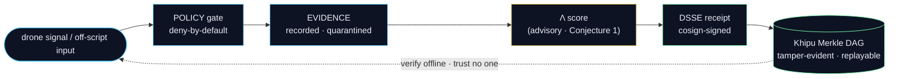

<!--
  Personal profile README — stephenlutar2-hash/stephenlutar2-hash
  Genius Series-A grade. Honesty doctrine v11 LOCKED.
  Canonical numbers (source of truth: lutar-lean@main, kernel c7c0ba17):
    749 declarations / 14 unique axioms / 163 tracked sorries
    Proven (locked kernel) = exactly 5 formulas {F1, F11, F12, F18, F19}
    Lambda-uniqueness = Conjecture 1 (never a theorem)
    SLSA Build L2 verified on service images (NOT L3)
  Aligned to the two-product Hugging Face end-state: a11oy (command platform) + killinchu (drones & vessels).
  Zero user-facing dead-organ references; zero broken links to retired Spaces.
  IMAGE POLICY: all raster assets referenced by ABSOLUTE raw.githubusercontent URLs (relative
  paths can break on the profile render); the proof-flow diagram uses native mermaid so it ALWAYS renders.
-->

<div align="center">


# Stephen P. Lutar Jr.

### Founder & CEO, SZL Holdings — cryptographic proof infrastructure for consequential AI decisions

</div>

<div align="center">

<a href="https://stephenlutar2-hash.github.io/stephenlutar2-hash/"></a>

<b><a href="https://stephenlutar2-hash.github.io/stephenlutar2-hash/">▶ Walk the live 3D build timeline</a></b>  ·  <b><a href="https://szl-holdings.github.io/.github/">▶ Open the live SZL constellation</a></b>

</div>

$$\Lambda(x) \;=\; \sum_{i=1}^{13} w_i\,\phi_i(x), \qquad \sum_{i=1}^{13} w_i = 1,\quad w_i \ge 0, \qquad \texttt{receipts.in} \equiv \texttt{receipts.out}$$

<div align="center"><sub>The 13-axis <code>yuyay_v3</code> aggregator. A2 = <code>IsHomogeneous</code>, A4 = <code>IsBounded</code>. Λ-uniqueness is <a href="https://github.com/szl-holdings/lutar-lean">Conjecture 1</a>, not a closed theorem. Open bounty at <a href="https://github.com/szl-holdings/lutar-lean/blob/main/BOUNTY.md">BOUNTY.md</a>.</sub></div>

```lean
-- machine-checked in lutar-lean@main (kernel c7c0ba17)
theorem lambda_bounded (x : ReceiptBus) : ‖Λ x‖ ≤ 1 := by
  simpa using isBounded_lambda x   -- A4 : IsBounded
```

---

## The founder story

I started SZL Holdings with one conviction: **AI is moving into consequential decisions before the field has a proof layer**.

Defense, healthcare, finance — operators are deploying AI that affects real outcomes, with no standard way to show *what it decided, why, and whether it stayed within authorized parameters*. Logs exist. Dashboards exist. **Cryptographic proof does not**.

The entire SZL stack is a machine for producing that proof — a DSSE-enveloped, hash-linked Khipu receipt that any auditor can verify on their own hardware, using public tooling, after the fact. The math is pinned in Lean 4. The supply chain is SLSA Build L2 verified. The shipping artifact is a signed UDS bundle deployable into any air-gapped cluster in one command.

I publish the numbers honestly. The **locked kernel** (Lean `v4.13.0`, `c7c0ba17`) is **749** declarations, **14** axioms, **163** tracked sorries, and **exactly 5 formulas** formally proven {`F1, F11, F12, F18, F19`} — a count that is itself a no-axiom Lean theorem (`locked_count_five`). On top of that, **~36 experimental theorems** are kernel-verified and **CI-green on `main` @ `7885fd9`** (Lean `v4.18.0`, `1304` declarations / `22` axioms): waves 5–8, agentic P1–P6, and airtight Λ. Everything newer than the locked 5 is labeled experimental and never folded into the locked count. **Λ-uniqueness is Conjecture 1** — I don't claim theorems I haven't proved; unconditional uniqueness is machine-checked **false**. That honesty is a deliberate competitive choice: at DoD-adjacent events where overclaiming gets punished, credibility is the moat.

**Defense Unicorns published this as an unsolved problem at Warhacker 2026:** *“When a drone loses contact mid-mission — is the AI still operating within its authorized parameters, or has it gone off script? There’s no independent system today that can monitor AI behavior in real time, catch the moment a line gets crossed, and back it up with a permanent, tamper-evident record.”* That is the Cannonico problem. **SZL is the Cannonico answer** — and the answer is now machine-checked as a *system*: untrusted, off-script input **provably cannot** flip a safety verdict (non-interference, Goguen–Meseguer), proven axiom-free in [PR #188](https://github.com/szl-holdings/lutar-lean/pull/188).



---

<p align="center">
  <a href="https://orcid.org/0009-0001-0110-4173"></a>
  <a href="https://www.linkedin.com/in/stephen-l-279315240/"></a>
  <a href="https://huggingface.co/SZLHOLDINGS"></a>
  <a href="https://doi.org/10.5281/zenodo.19944926"></a>
  <a href="https://github.com/szl-holdings/.github/tree/main/doctrine"></a>
  <a href="https://github.com/szl-holdings/a11oy/attestations"></a>
  <a href="https://github.com/szl-holdings/szl-mesh"></a>
</p>

---

## What I'm building

**[SZL Holdings](https://github.com/szl-holdings)** — two live products on one signed substrate:

| Product | What it does | Live |
|---|---|---|
| [**a11oy** — Command Platform](https://huggingface.co/spaces/SZLHOLDINGS/a11oy) | One pane of glass for governed AI: ask &amp; act, deny-by-default safety gates, trust scoring, a live decision feed, readiness / compliance, forecasting, signed receipts, formal-proof status, a live CVE / KEV / MITRE threat library, and model routing. Its reasoning, policy, and operator capabilities are built in as one receipt-bound fabric. | [](https://szlholdings-a11oy.hf.space/) |
| [**killinchu** — Drones &amp; Vessels](https://huggingface.co/spaces/SZLHOLDINGS/killinchu) | Autonomous-systems field tool for air and sea: live track board, multi-sensor fusion, maritime picture (sanctions + dark-vessel detection), engagement rules, swarm / autonomy governance, and **verify-it-yourself** signed engagement receipts. | [](https://szlholdings-killinchu.hf.space/elite) |

Both ship as a single signed UDS bundle: `uds deploy oci://ghcr.io/szl-holdings/szl-mesh:0.4.0 --confirm`

---

## The proof — verifiable now

```bash
# Verify SLSA L2 provenance on the command platform image:
gh attestation verify oci://ghcr.io/szl-holdings/a11oy:latest \
  --repo szl-holdings/a11oy
# ✓ Verification succeeded

# Verify the signed mesh bundle:
cosign verify oci://ghcr.io/szl-holdings/szl-mesh:0.4.0 \
  --certificate-identity-regexp="^https://github.com/szl-holdings/" \
  --certificate-oidc-issuer="https://token.actions.githubusercontent.com"

# Verify a killinchu engagement receipt offline — trust no one:
curl -s https://szlholdings-killinchu.hf.space/cosign.pub -o cosign.pub
curl -s https://szlholdings-killinchu.hf.space/api/killinchu/v1/receipt/export > receipt.json
# verify the DSSE signature offline -> "Verified OK"; tamper one byte -> "Verification failure"

# Full guide: https://github.com/szl-holdings/developers
```

---

## Substrate at a glance — honest, verifiable

| Metric | Value | Source |
|---|---|---|
| Lean 4 declarations | **749** | [`lutar-lean@main`](https://github.com/szl-holdings/lutar-lean) |
| Unique axioms | **14** (15 raw, 1 duplicate) | [`lean_numbers.json`](https://github.com/szl-holdings/.github/blob/main/.github/data/lean_numbers.json) |
| Tracked sorries | **163** | regenerated by `lean_numbers.py` |
| Formulas proven (locked kernel) | **exactly 5** — `F1, F11, F12, F18, F19` | machine-checked in `lutar-lean` (`locked_count_five`, no axioms) |
| Experimental theorems (CI-green) | **~36**, labeled, **not** in the locked count | `main` @ `7885fd9` — waves 5–8 · agentic P1–P6 · airtight Λ |
| Current main (experimental scope) | **1304** declarations / **22** unique axioms · Lean `v4.18.0` | [`lutar-lean@main`](https://github.com/szl-holdings/lutar-lean) `7885fd9` |
| Λ uniqueness | **Conjecture 1** (open bounty) | not a closed theorem |
| SLSA posture | **Build L2 verified** on service images | `gh attestation verify` |
| UDS bundle | **`szl-mesh:0.4.0`** — signed, real baked images | GHCR |
| Kernel commit | **`c7c0ba17`** | `lutar-lean@main` |
| Doctrine | **v11 LOCKED** | [szl-holdings/.github](https://github.com/szl-holdings/.github) |

> I do not claim “zero sorry,” “fully verified,” or “Λ proven.” Every number above regenerates from `lutar-lean@main`. SLSA L3 is not claimed.

### Proven formulas — what's locked vs. experimental (honest)

| Set | What | Maturity |
|---|---|---|
| **Locked (5)** | `F1` replay determinism · `F11` Ayni reciprocity · `F12` Kuramoto (additive fragment) · `F18` Reed–Solomon RS(10,6) recovery · `F19` Bekenstein (additive scaffolding) | **PROVEN**, sorry-free @ `c7c0ba17` |
| **Experimental, CI-green (~36)** | agentic-loop P1–P6 ([#188](https://github.com/szl-holdings/lutar-lean/pull/188)) · wave-5 ([#186](https://github.com/szl-holdings/lutar-lean/pull/186)) · wave-6 ([#189](https://github.com/szl-holdings/lutar-lean/pull/189)) · wave-7 ([#190](https://github.com/szl-holdings/lutar-lean/pull/190)) · **wave-8** (10 theorems @ `7885fd9`: M2 hash-chain tamper-evidence, CP1 split-conformal coverage, B1 Byzantine n=3f+1, L2 min-gate uniqueness, …) · airtight Λ Set α+δ ([#192](https://github.com/szl-holdings/lutar-lean/pull/192)) | kernel-verified on `main` @ `7885fd9`, **never** in the locked 5 |
| **Λ-uniqueness** | unique only *conditionally* within strengthened axiom classes (CI-green); unconditional uniqueness machine-checked **false** | **Conjecture 1** |

Full proof table with verbatim `#print axioms` → **[PROVEN_FORMULAS.md](https://github.com/szl-holdings/lutar-lean/blob/main/PROVEN_FORMULAS.md)**.

---

## 3D visualizations — live WebGL

| Scene | What you see |
|---|---|
| [anatomy-3d](https://betterwithage-anatomy-3d.static.hf.space) | 3D anatomy — Λ-gate, Khipu DAG, Ouroboros loop |
| [mesh-cathedral](https://betterwithage-mesh-cathedral.static.hf.space) | The Ouroboros loop — bounded-recursion substrate |
| [khipu-constellation](https://betterwithage-khipu-constellation.static.hf.space) | 3D Merkle-DAG — Khipu knot-graph in space |
| [doctrine-cathedral](https://betterwithage-doctrine-cathedral.static.hf.space) | 749 declarations as cathedral geometry |
| [llm-router-live](https://betterwithage-llm-router-live.static.hf.space) | Live LLM dispatch mesh topology |

---

## Research — DOI-pinned

Concept DOI (always latest): [`10.5281/zenodo.19944926`](https://doi.org/10.5281/zenodo.19944926)

| Version | DOI |
|---|---|
| v18.0 (master) | [`10.5281/zenodo.20434276`](https://doi.org/10.5281/zenodo.20434276) |
| v18.0.0 (software) | [`10.5281/zenodo.20434308`](https://doi.org/10.5281/zenodo.20434308) |
| v17 | [`10.5281/zenodo.20431181`](https://doi.org/10.5281/zenodo.20431181) |
| v16 | [`10.5281/zenodo.20424996`](https://doi.org/10.5281/zenodo.20424996) |
| v15 | [`10.5281/zenodo.20424995`](https://doi.org/10.5281/zenodo.20424995) |
| v14 | [`10.5281/zenodo.20424992`](https://doi.org/10.5281/zenodo.20424992) |
| v11 (applied) | [`10.5281/zenodo.20119582`](https://doi.org/10.5281/zenodo.20119582) |
| v3 (Lutar Invariant) | [`10.5281/zenodo.19983066`](https://doi.org/10.5281/zenodo.19983066) |
| v1 (position) | [`10.5281/zenodo.19867281`](https://doi.org/10.5281/zenodo.19867281) |

---

## Stack

**Languages:** TypeScript · Python · Lean 4 · Bash  
**Runtime:** Node.js 24 · pnpm · React · Vite · FastAPI  
**Data:** PostgreSQL · Drizzle ORM · Redis · pgvector  
**Supply chain:** Sigstore (SLSA L2) · Zenodo · CodeQL · Trivy · Gitleaks · OpenSSF Scorecard · SBOM  
**Observability:** OpenTelemetry · 13-axis Λ-spans  
**Deployment:** UDS Core / Zarf · uds-cli · Kubernetes / Istio Ambient

<p align="center">
  
</p>

---

## Contact

| | |
|---|---|
| Email | [`stephen@szlholdings.com`](mailto:stephen@szlholdings.com) |
| ORCID | [`0009-0001-0110-4173`](https://orcid.org/0009-0001-0110-4173) |
| LinkedIn | [stephen-l-279315240](https://www.linkedin.com/in/stephen-l-279315240/) |
| Hugging Face | [SZLHOLDINGS](https://huggingface.co/SZLHOLDINGS) |
| Security | [`security@szlholdings.com`](mailto:security@szlholdings.com) · [policy](https://github.com/szl-holdings/.github/security/policy) |

---

<sub>© 2026 Stephen P. Lutar Jr. · Code: Apache-2.0 · Research: CC BY 4.0 · Doctrine v11 LOCKED · Every count and DOI on this page is verifiable against <a href="https://github.com/szl-holdings/lutar-lean">lutar-lean@main</a>. Λ-uniqueness is Conjecture 1. SLSA L2 verified (not L3).</sub>

Signed-off-by: Stephen P. Lutar Jr. <stephenlutar2@gmail.com>
