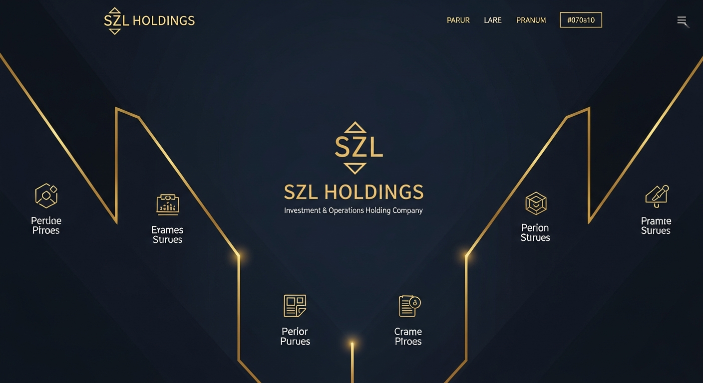

<p align="center">
  
</p>

<p align="center">
  
</p>

<p align="center">
  <a href="https://linkedin.com/in/stephenlutar"></a>
  <a href="https://x.com/szlholdings"></a>
  <a href="https://szlholdings.substack.com"></a>
  <a href="https://medium.com/@stephen_38454"></a>
  <a href="https://szlholdings.com"></a>
</p>

<p align="center">
  
</p>

---

## About

**Founder & CEO** at [SZL Holdings](https://szlholdings.com) — a strategic holding company operating six purpose-built intelligence platforms on a single TypeScript monorepo.

Building governed operational intelligence software for industries where silent failures, invisible risk, and unaccountable AI are not acceptable.

---

## The Numbers

```
16  applications live          8 web + 8 mobile
446 database tables            one shared schema
1,618+ API endpoints           full TypeScript
6   operating platforms        one compounding architecture
1   founder                    builder-operator
```

---

## Tech Stack

<p align="center">
  
</p>

---

## The Platforms

| Platform | Domain | What It Does |
|----------|--------|-------------|
| **Lyte** | Business Observability | Surfaces execution risk, ownership drift, and workflow friction before they compound |
| **Alloy** | Execution Engine | Signal normalization, workflow orchestration, approval gates, and immutable audit trails |
| **Vessels** | Maritime Intelligence | Fleet command, AIS analytics, voyage management, and compliance monitoring |
| **Aegis** | Defense & Intelligence | Unified SOC command — threat correlation, incident governance, and security posture |
| **Terra** | Real Estate Intelligence | Market intelligence, distress engine, deal pipeline, and portfolio analytics |
| **PRISM Counsel** | Legal Matter Command | Deadline tracking, pressure scoring, proof chain export, and document handling |
| **Carlota Jo** | Private Advisory | Bespoke coordination and management for luxury residential environments |

---

## Architecture

```
                    ┌─────────────────────────────────┐
                    │         SZL Holdings             │
                    │    One Monorepo · TypeScript      │
                    └───────────────┬──────────────────┘
                                    │
                    ┌───────────────┴──────────────────┐
                    │           Lyte + Alloy            │
                    │   Observability + Execution        │
                    │   Signal → Action → Audit Trail    │
                    └───────────────┬──────────────────┘
                                    │
          ┌─────────┬───────────┬───┴────┬──────────┬──────────┐
          │         │           │        │          │          │
       Vessels    Aegis      Terra    PRISM     Carlota    Custom
       Maritime   Defense    Real     Legal      Jo        Domain
       Command    & Intel    Estate   Matter    Advisory    Packs
```

---

## Principles

- **AI governance by design.** Advisory agents cannot execute without explicit human confirmation.
- **Evidence-backed decisions.** Every AI recommendation includes source citations and confidence scores.
- **Explicit over implicit.** Platform state is always visible. Failures surface, not hide.
- **Shared fabric, domain specialization.** Every improvement compounds across every platform.

---

## Writing

- **Substack:** [Signal Over Noise](https://szlholdings.substack.com) — biweekly intelligence brief on business observability, AI governance, and founder operations
- **Medium:** [Stephen Lutar](https://medium.com/@stephen_38454) — long-form thinking on architecture, domain intelligence, and operating philosophy

---

<p align="center">
  <i>Open to design partner conversations, enterprise evaluation, and investment introductions.</i>
</p>
