<p align="center">
  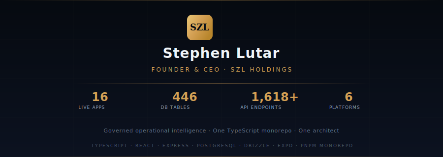
</p>

<p align="center">
  <a href="https://szlholdings.com"></a>
  <a href="https://linkedin.com/in/stephenlutar"></a>
  <a href="https://szlholdings.substack.com"></a>
</p>

<p align="center">
  <a href="https://x.com/szlholdings"></a>
  <a href="https://medium.com/@stephen_38454"></a>
  <a href="mailto:stephenlutar2@gmail.com"></a>
</p>

---

### Builder-operator behind SZL Holdings.

One holding company. One platform. 14 registered artifacts. One architect.

I build governed operational intelligence software for industries where silent failures, invisible risk, and unaccountable AI are not acceptable. Everything ships from a single TypeScript monorepo. Every improvement compounds across every platform.

---

<p align="center">
  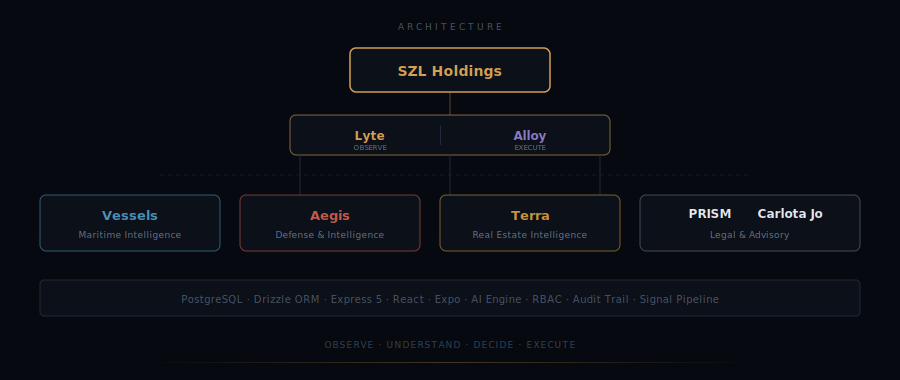
</p>

---

### The Platforms — Live and Deployed

<table>
  <tr>
    <td width="50%" align="center">
      <strong>Vessels — Maritime Intelligence</strong><br/>
      Fleet command, AIS analytics, voyage management, compliance monitoring<br/><br/>
      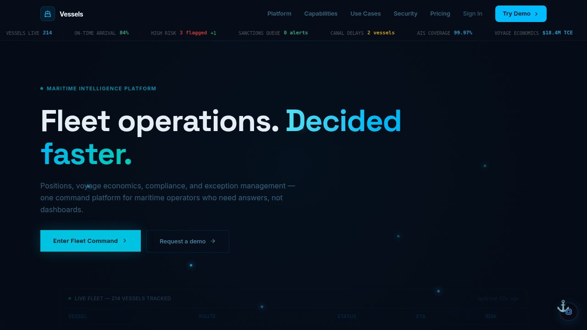
    </td>
    <td width="50%" align="center">
      <strong>Aegis — Defense and Intelligence</strong><br/>
      Unified SOC command, threat correlation, incident governance<br/><br/>
      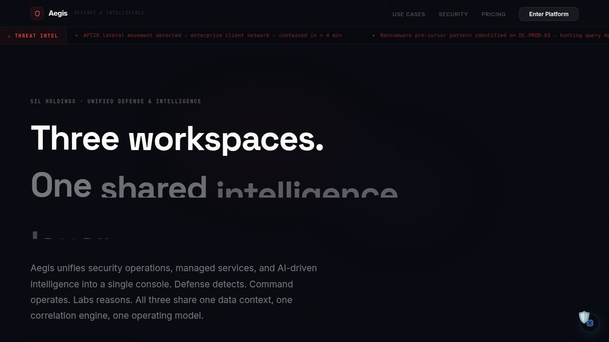
    </td>
  </tr>
  <tr>
    <td width="50%" align="center">
      <strong>Terra — Real Estate Intelligence</strong><br/>
      Market intelligence, distress engine, deal pipeline, portfolio analytics<br/><br/>
      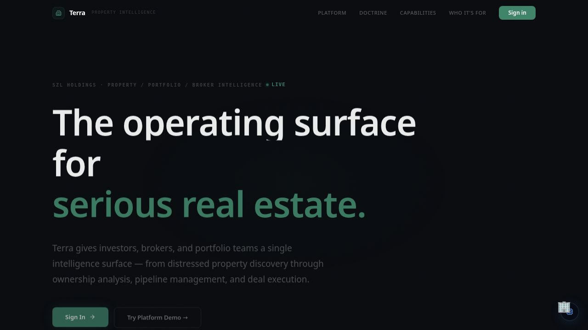
    </td>
    <td width="50%" align="center">
      <strong>Lyte — Business Observability</strong><br/>
      Execution risk, ownership drift, workflow friction analysis<br/><br/>
      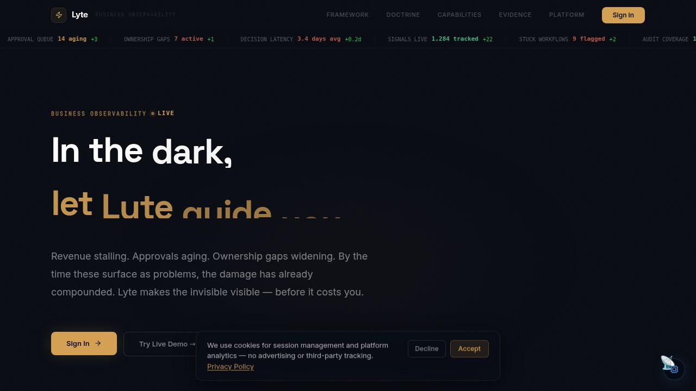
    </td>
  </tr>
  <tr>
    <td width="50%" align="center">
      <strong>Counsel — Legal Matter Command</strong><br/>
      Matter command, obligation tracking, exposure quantification, legal intelligence<br/><br/>
      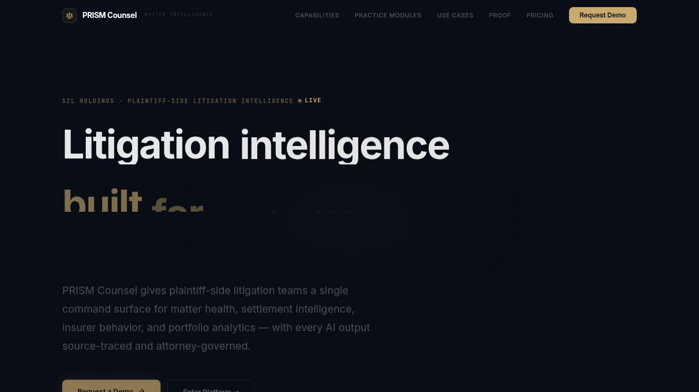
    </td>
    <td width="50%" align="center">
      <strong>Carlota Jo — Private Advisory</strong><br/>
      Bespoke coordination for luxury residential environments<br/><br/>
      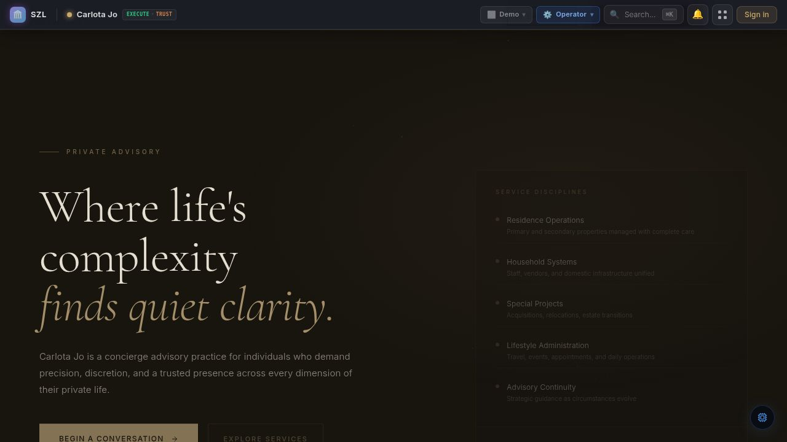
    </td>
  </tr>
  <tr>
    <td width="50%" align="center">
      <strong>SZL Holdings — Command Surface</strong><br/>
      Holding company dashboard, cross-platform intelligence<br/><br/>
      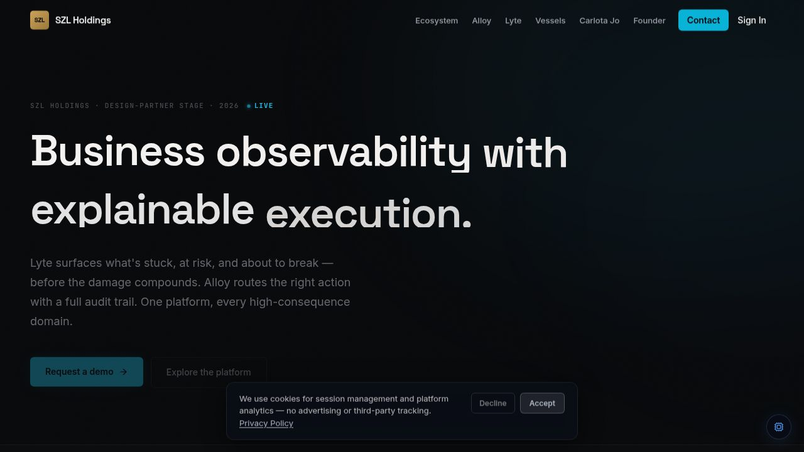
    </td>
    <td width="50%" align="center">
      <strong>Stephen Lutar — Founder Portfolio</strong><br/>
      Personal site, ecosystem overview, case studies<br/><br/>
      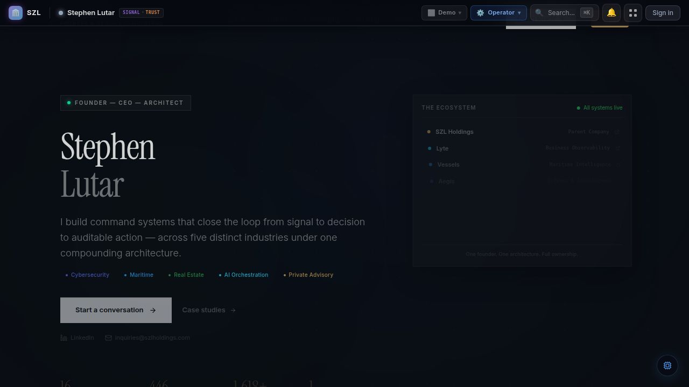
    </td>
  </tr>
</table>

---

<p align="center">
  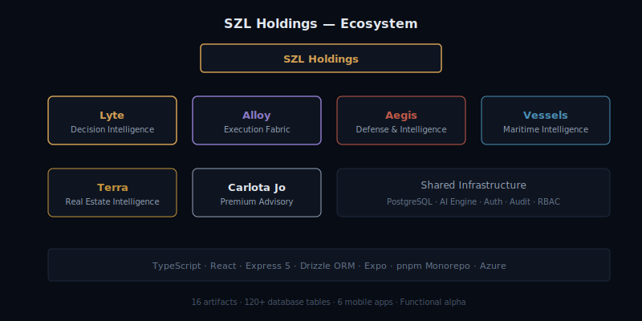
</p>

---

### The Numbers

```
14    registered artifacts           11 web + 1 mobile (Expo) + 1 video + 1 design
798   database tables                one shared PostgreSQL schema
2,816 API endpoints                  full TypeScript, zero JavaScript
8     domain verticals               one compounding architecture
1     founder                        builder-operator
```

### Stack

<p align="center">
  
</p>

```
TypeScript · React · Vite · Express 5 · PostgreSQL · Drizzle ORM · Expo · pnpm monorepo
AI Advisors (governed) · RBAC · Audit Trail · Signal Pipeline · WebSocket · GraphQL
```

---

### Principles

- **AI governance by design.** Advisory agents cannot execute without explicit human confirmation.
- **Evidence-backed decisions.** Every AI recommendation includes source citations and confidence scores.
- **Explicit over implicit.** Platform state is always visible. Failures surface, not hide.
- **Shared fabric, domain specialization.** Every improvement compounds across every platform.

---

### Writing

- **Substack:** [Signal Over Noise](https://szlholdings.substack.com) — intelligence brief on business observability, AI governance, and founder operations
- **Medium:** [Stephen Lutar](https://medium.com/@stephen_38454) — long-form thinking on architecture, domain intelligence, and operating philosophy

---

<p align="center">
  <em>We do not publish source code. This organization operates private repositories.</em>
</p>

<p align="center">
  <em>Open to design partner conversations, enterprise evaluation, and investment introductions.</em>
</p>

<p align="center">
  <a href="mailto:stephenlutar2@gmail.com"><strong>stephenlutar2@gmail.com</strong></a>
</p>
