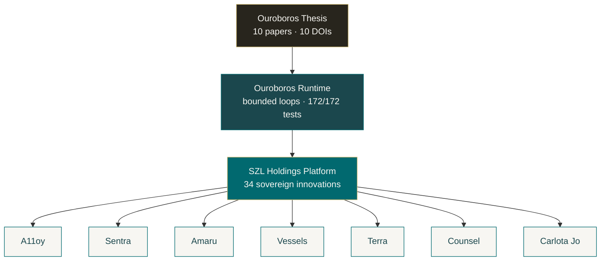

<!--
  Personal profile README — stephenlutar2-hash/stephenlutar2-hash
  Style: researcher-founder. Hydra Teal brand. No emojis.
-->

# Stephen P. Lutar Jr.

> Founder & CEO, [SZL Holdings](https://github.com/szl-holdings).
> Building **governed decision intelligence** for regulated enterprises — AI that is auditable by construction, not by promise.

  
  
  
  
  
  

---

## What I build

**[SZL Holdings](https://github.com/szl-holdings)** — a governed operational-intelligence stack for regulated enterprises across seven industry surfaces, all sitting on one research foundation.

| Layer | What it is | Status |
|---|---|---|
| [Ouroboros Thesis](https://github.com/szl-holdings/ouroboros-thesis) | Ten canonical papers (v1 → v10), DOI lineage, every formula bound to running code | v10 published · 10 Zenodo DOIs |
| [Ouroboros Runtime](https://github.com/szl-holdings/ouroboros) | Bounded-loop runtime with measurable convergence and audit closure | v6.2.0 · 172/172 tests green |
| [Sovereign Engine](https://github.com/szl-holdings/szl-holdings-platform) | TypeScript monorepo — 34 original innovations in governed AI | 48/48 API endpoints passing |

---

## Products on the platform

Seven vertical operator surfaces, one runtime:

| Surface | Domain | Repo |
|---|---|---|
| **A11oy** | Brand orchestration & AI governance | [`a11oy`](https://github.com/szl-holdings/a11oy) |
| **Sentra** | Cyber resilience command | [`sentra`](https://github.com/szl-holdings/sentra) |
| **Amaru** | Convergent data sync (Andean ouroboros) | [`amaru`](https://github.com/szl-holdings/amaru) |
| **Vessels** | Maritime fleet intelligence | [`vessels`](https://github.com/szl-holdings/vessels) |
| **Terra** | Real-estate intelligence | [`terra`](https://github.com/szl-holdings/terra) |
| **Counsel** | Legal matter command | [`counsel`](https://github.com/szl-holdings/counsel) |
| **Carlota Jo** | UHNW advisory operations | [`carlota-jo`](https://github.com/szl-holdings/carlota-jo) |

---

## Research highlights

- **34 sovereign innovations** operational in TypeScript — EPR-Bell quantum diagnostics, Hopfield associative memory, predictive coding, sacred-geometry coherence, cognitive maps, dynamical bifurcation detection, and 28 more.
- **10 papers** (v1 → v10) with verifiable claims, falsification ledgers, and explicit *what this paper does and does not claim* sections.
- **Concept DOI** [`10.5281/zenodo.19944926`](https://doi.org/10.5281/zenodo.19944926) always resolves to the latest version. Versioned DOIs per paper.
- Formulas verified against running code: **CHSH S = 2·√2**, **φ = 1.618 033 988 749 895** (15 decimal places), Fibonacci verified to F(20).
- Every citation traced to a real publication: Einstein 1935, Bell 1964, Hopfield 1982, Friston 2010, Hoffmann 2022, and the rest of the chain.

### Paper chain — v1 → v10

| # | Title | DOI |
|---|---|---|
| v10 | EXHAUSTIVE-AUDIT — Audit Closure Operator Λ₁₀ | [`10.5281/zenodo.20053163`](https://doi.org/10.5281/zenodo.20053163) |
| v9 | UNIFIED-OPERATIONAL — Lutar Family v1 → v7 + Ω with Bianchi closure | [`10.5281/zenodo.20053148`](https://doi.org/10.5281/zenodo.20053148) |
| v8 | Free-Energy Active Inference + Predictive Coding + Cognitive Maps | [`10.5281/zenodo.20020849`](https://doi.org/10.5281/zenodo.20020849) |
| v7 | Sefirot Memory + Hopfield Associative Retrieval | [`10.5281/zenodo.20020848`](https://doi.org/10.5281/zenodo.20020848) |
| v6 | Hermetic Safety + Chinchilla-Lutar Scaling + Bifurcation | [`10.5281/zenodo.20020845`](https://doi.org/10.5281/zenodo.20020845) |
| v5 | Prisca-GraphRAG + Tawa SAE Interpretability | [`10.5281/zenodo.20020846`](https://doi.org/10.5281/zenodo.20020846) |
| v4 | Omega Formalism + EPR-Bell + Sacred Geometry | [`10.5281/zenodo.20020841`](https://doi.org/10.5281/zenodo.20020841) |
| v3 | The Lutar Invariant — axiomatic trust aggregator | [`10.5281/zenodo.19983066`](https://doi.org/10.5281/zenodo.19983066) |
| v2 | Empirical companion — A11oy / Sentra / Amaru case studies | [`10.5281/zenodo.19934129`](https://doi.org/10.5281/zenodo.19934129) |
| v1 | Position paper — bounded looped computation | [`10.5281/zenodo.19867281`](https://doi.org/10.5281/zenodo.19867281) |

---

## Engineering principles

- **Determinism over plausibility.** Loops are bounded with measurable convergence; outputs carry audit closure.
- **Supply-chain hygiene as a feature.** SHA-pinned actions, harden-runner egress policy, signed releases, SBOM on every build, OpenSSF Scorecard tracking.
- **Falsifiability.** Every paper has a *how this could be wrong* section. Every claim has a test.
- **One runtime, many surfaces.** Vertical surfaces share infrastructure, governance, and provenance.

---

## Stack & tooling

`TypeScript` · `Node.js` · `PostgreSQL` (Neon) · `Drizzle ORM` · `Python` · `Bash` · `GitHub Actions` · `CodeQL` · `Trivy` · `Gitleaks` · `Sigstore / cosign` · `Hetzner` · `PM2` · `Pandoc` · `WeasyPrint`

---

## Activity

  
  

---

## Contact

**Stephen P. Lutar Jr.** — Principal · SZL Holdings
[`stephenlutar2@gmail.com`](mailto:stephenlutar2@gmail.com) · [ORCID `0009-0001-0110-4173`](https://orcid.org/0009-0001-0110-4173) · [LinkedIn](https://linkedin.com/in/stephen-l-279315240) · [`szlholdings.com`](https://szlholdings.com)

For security disclosures, see the [SZL Holdings security policy](https://github.com/szl-holdings/.github/security/policy) or email `security@szlholdings.com`.

© 2026 Stephen P. Lutar Jr. — Code released under MIT. Research released under CC BY 4.0.
