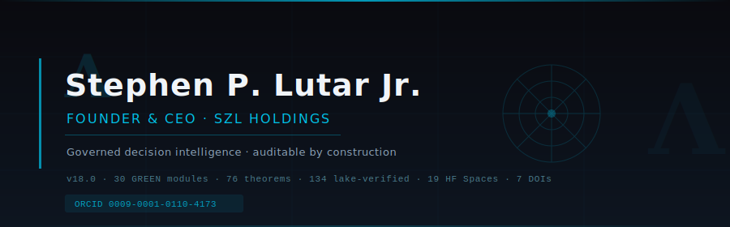
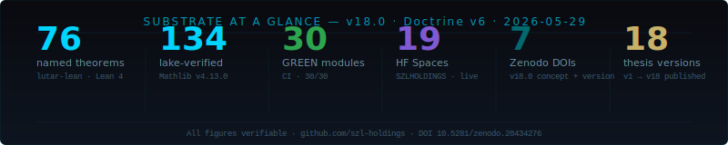
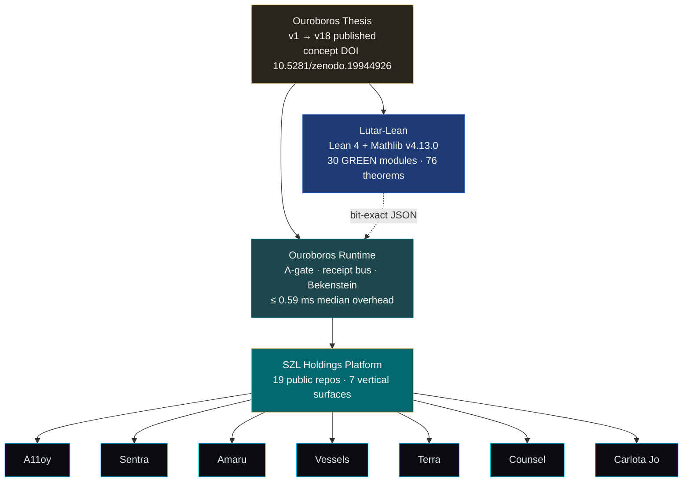
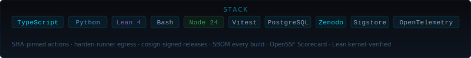

<!--
  Personal profile README — stephenlutar2-hash/stephenlutar2-hash
  Doctrine v6. No marketing superlatives. Every number verifiable.
  Last substantive update: 2026-05-29 (aligned to v18.0, 30 GREEN modules)
  Stats auto-refreshed daily by .github/workflows/update-stats.yml
-->

  

  
  
  
  
  
  
  
  

---

## What I build

**[SZL Holdings](https://github.com/szl-holdings)** is a governed decision-intelligence substrate for regulated enterprises — a Λ-axis audit-closure operator, proved in Lean 4 (Mathlib v4.13.0), running at sub-millisecond overhead, emitting a SHA-pinned receipt for every decision.

Org page: [github.com/szl-holdings](https://github.com/szl-holdings)

---

## Substrate at a glance

  

| Metric | Count | Source |
|---|---|---|
| Named Lean theorems | **76** | [`lutar-lean`](https://github.com/szl-holdings/lutar-lean) |
| Lake-verified proofs | **134** | Mathlib v4.13.0 |
| GREEN Lean modules | **30 / 30** | CI · [`lutar-lean`](https://github.com/szl-holdings/lutar-lean) |
| HF Spaces (live) | **19** | [SZLHOLDINGS](https://huggingface.co/SZLHOLDINGS) |
| Zenodo DOIs | **7** | concept + v18 master + v18 software + v17/v16/v15/v14 |
| Thesis versions published | **18** | v1 → v18 · [ouroboros-thesis](https://github.com/szl-holdings/ouroboros-thesis) |
| Org repos | **19** | [szl-holdings](https://github.com/szl-holdings) |

---

## Current focus

**Thesis v18.0** — published 2026-05-29.
- Master DOI: [`10.5281/zenodo.20434276`](https://doi.org/10.5281/zenodo.20434276)
- Software DOI: [`10.5281/zenodo.20434308`](https://doi.org/10.5281/zenodo.20434308)
- Concept DOI (always latest): [`10.5281/zenodo.19944926`](https://doi.org/10.5281/zenodo.19944926)

**Warhacker 2026 (June 16–20)** — SZL Governance Receipts on UDS. k3d + uds-cli + Pepr DSSE receipt policy. Tracked in `szl-holdings/platform` (Warhacker deployment branch).

**AIMS@COLM26** — T4 / T13 extended abstracts queued in `ouroboros-thesis/aims_colm26/` (in-progress).

**Runtime overhead** — ≤ 0.59 ms median per request. Measured across 24,800 paired HTTP calls (v11 bench, [`10.5281/zenodo.20119582`](https://doi.org/10.5281/zenodo.20119582)).

---

## Pinned repos

Six repos pinned in GitHub UI. Pin them at [github.com/stephenlutar2-hash](https://github.com/stephenlutar2-hash):

| Repo | What it is |
|---|---|
| [`szl-holdings/a11oy`](https://github.com/szl-holdings/a11oy) | Brand orchestration + AI governance surface |
| [`szl-holdings/lutar-lean`](https://github.com/szl-holdings/lutar-lean) | Lean 4 + Mathlib kernel proofs · 30 GREEN modules |
| [`szl-holdings/ouroboros`](https://github.com/szl-holdings/ouroboros) | Bounded-recursion runtime · Λ-gate · receipt emission |
| [`szl-holdings/ouroboros-thesis`](https://github.com/szl-holdings/ouroboros-thesis) | DOI-pinned thesis substrate · v1 → v18 |
| [`szl-holdings/uds-mesh`](https://github.com/szl-holdings/uds-mesh) | UDS span schemas + governance receipts |
| [`szl-holdings/sentra`](https://github.com/szl-holdings/sentra) | Cyber-resilience command surface |

---

## Architecture

---

## Research — DOI-pinned

18 published versions. Every claim terminates in a DOI, a commit SHA, a Lean theorem, or a CI run.

| Version | Title | DOI |
|---|---|---|
| **v18.0** | Λ-Axis Substrate for Verifiable Agentic AI — doctrine v6, 11 axioms, 30 GREEN modules | [`10.5281/zenodo.20434276`](https://doi.org/10.5281/zenodo.20434276) |
| **v18.0.0** (software) | Reference runtime + Lean kernel for v18 | [`10.5281/zenodo.20434308`](https://doi.org/10.5281/zenodo.20434308) |
| v17 | | [`10.5281/zenodo.20431181`](https://doi.org/10.5281/zenodo.20431181) |
| v16 | | [`10.5281/zenodo.20424996`](https://doi.org/10.5281/zenodo.20424996) |
| v15 | | [`10.5281/zenodo.20424995`](https://doi.org/10.5281/zenodo.20424995) |
| v14 | | [`10.5281/zenodo.20424992`](https://doi.org/10.5281/zenodo.20424992) |
| v11 | APPLIED-Λ — Measured per-request overhead | [`10.5281/zenodo.20119582`](https://doi.org/10.5281/zenodo.20119582) |
| v10 | EXHAUSTIVE-AUDIT — Λ₁₀ audit closure | [`10.5281/zenodo.20053163`](https://doi.org/10.5281/zenodo.20053163) |
| v9 | UNIFIED-OPERATIONAL — Lutar family + Bianchi closure | [`10.5281/zenodo.20053148`](https://doi.org/10.5281/zenodo.20053148) |
| v3 | The Lutar Invariant — axiomatic trust aggregator | [`10.5281/zenodo.19983066`](https://doi.org/10.5281/zenodo.19983066) |
| v2 | Empirical companion — A11oy / Sentra / Amaru | [`10.5281/zenodo.19934129`](https://doi.org/10.5281/zenodo.19934129) |
| v1 | Position paper — bounded looped computation | [`10.5281/zenodo.19867281`](https://doi.org/10.5281/zenodo.19867281) |

Concept DOI (always latest): [`10.5281/zenodo.19944926`](https://doi.org/10.5281/zenodo.19944926)

---

## What this work claims and does not claim

- Lean-kernel proof that `Λ_k(x) = (∏ xᵢ)^(1/k)` is the unique aggregator satisfying axioms A1–A4 (monotone · homogeneous · Egyptian-exact · bounded). [Source](https://github.com/szl-holdings/lutar-lean/blob/main/Lutar/Uniqueness.lean).
- Bit-exact reproduction of Λ₉ on published golden vectors across three production runtimes (a11oy / amaru / sentra) and the Lean Float implementation. [Reference vectors](https://github.com/szl-holdings/platform/blob/main/packages/ouroboros-invariant/reference-vectors/reference-vectors.json).
- Measured per-request overhead across 24,800 paired HTTP calls (v11 paper, [`10.5281/zenodo.20119582`](https://doi.org/10.5281/zenodo.20119582)).
- Not a quantum computer. Quantum modules use quantum-analogy math to derive bounds on classical hardware.
- Not a free-energy device. "Free-energy" is Friston variational FEP, not thermodynamic free energy.

---

## Stack

  

**Languages:** TypeScript · Python · Lean 4 · Bash
**Runtime:** Node.js 24 · pnpm 10 · React · Vite
**Data:** PostgreSQL (Neon) · Drizzle ORM · Redis · pgvector
**Cloud:** Hetzner · Cloudflare · Sigstore · Zenodo
**Quality:** Vitest · Playwright · CodeQL · Trivy · Gitleaks · OpenSSF Scorecard · Lean kernel
**Observability:** OpenTelemetry · Pino · PM2

---

## Activity

<!-- STATS_START — auto-updated daily by .github/workflows/update-stats.yml -->
| Metric | Value |
|---|---|
| Today's commits across szl-holdings | <!-- DAILY_COMMITS -->see workflow<!-- /DAILY_COMMITS --> |
| Active PRs | <!-- ACTIVE_PRS -->see workflow<!-- /ACTIVE_PRS --> |
| Latest thesis DOI | [`10.5281/zenodo.20434276`](https://doi.org/10.5281/zenodo.20434276) (v18.0) |
<!-- STATS_END -->

  
  

---

## Contact + credentials

**Stephen P. Lutar Jr.** — Founder & CEO, SZL Holdings

| | |
|---|---|
| Email | [`stephen@szlholdings.com`](mailto:stephen@szlholdings.com) |
| ORCID | [`0009-0001-0110-4173`](https://orcid.org/0009-0001-0110-4173) |
| LinkedIn | [stephen-l-279315240](https://linkedin.com/in/stephen-l-279315240) |
| HF | [huggingface.co/betterwithage](https://huggingface.co/betterwithage) · org [SZLHOLDINGS](https://huggingface.co/SZLHOLDINGS) |
| Zenodo | [zenodo.org/communities/szl-holdings](https://zenodo.org/communities/szl-holdings) |
| Web | [`szlholdings.com`](https://szlholdings.com) |
| Security | [`security@szlholdings.com`](mailto:security@szlholdings.com) · [security policy](https://github.com/szl-holdings/.github/security/policy) |

---

© 2026 Stephen P. Lutar Jr. — Code: Apache-2.0. Research: CC BY 4.0. Every test count and DOI on this page is verifiable; see linked audit logs and reference-vectors.json. Profile auto-refreshed by <a href=".github/workflows/update-stats.yml">update-stats.yml</a>.
