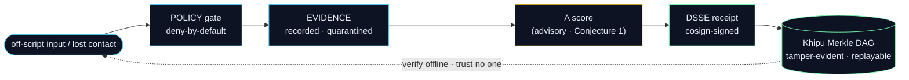

<!--
  Personal profile README — stephenlutar2-hash/stephenlutar2-hash
  Genius Series-A grade. Honesty doctrine LOCKED.
  Canonical numbers (source of truth: lutar-lean@main):
    LOCKED kernel (c7c0ba17, Lean v4.13.0): 749 declarations / 14 unique axioms / 163 tracked sorries
    locked-proven = EXACTLY 5 formulas {F1, F11, F12, F18, F19} (machine-enforced, no-axiom theorem)
    EXPERIMENTAL tier (CI-green on main, Lean v4.18.0): ~119 kernel-clean theorems across Waves 11-19,
      every #print axioms ⊆ {propext, Classical.choice, Quot.sound}; NEVER folded into the locked 5.
    Λ-uniqueness = Conjecture 1 (unconditional uniqueness machine-checked FALSE);
      proven CONDITIONAL on slice-multiplicativity/separability (CUT-2, axiom-free).
    Byzantine BFT safety = Conjecture 2 (faulty organ can equivocate).
    SLSA = Build L1 honest posture / L2 build-attestation present; L2-verified + L3 + FedRAMP = roadmap.
  Two products: a11oy (orchestration / Command Platform, incl. a11oy.code) + killinchu (maritime + counter-UAS C2).
  Warhacker is independent work referencing Defense Unicorns UDS — NOT an affiliation.
  IMAGE POLICY: raster assets via ABSOLUTE raw.githubusercontent URLs; diagrams use native mermaid so they always render.
-->

<div align="center">


# Stephen P. Lutar Jr.

### Founder & CEO, SZL Holdings — governed-AI decision infrastructure with a machine-checked Lean 4 proof backbone

</div>

<div align="center">

<b><a href="https://github.com/szl-holdings">github.com/szl-holdings</a></b> &nbsp;·&nbsp; <b><a href="https://huggingface.co/SZLHOLDINGS">🤗 SZLHOLDINGS</a></b> &nbsp;·&nbsp; <b><a href="https://orcid.org/0009-0001-0110-4173">ORCID</a></b> &nbsp;·&nbsp; <b><a href="https://doi.org/10.5281/zenodo.19944926">Zenodo concept DOI</a></b>

</div>

$$\Lambda(x) \;=\; \sum_{i=1}^{13} w_i\,\phi_i(x), \qquad \sum_{i=1}^{13} w_i = 1,\quad w_i \ge 0, \qquad \texttt{receipts.in} \equiv \texttt{receipts.out}$$

<div align="center"><sub>The 13-axis <code>yuyay_v3</code> trust aggregator. Λ-uniqueness is <a href="https://github.com/szl-holdings/lutar-lean">Conjecture 1</a> (not a closed theorem); the strongest <i>axiom-free conditional</i> uniqueness is machine-checked. Open bounty at <a href="https://github.com/szl-holdings/lutar-lean/blob/main/BOUNTY.md">BOUNTY.md</a>.</sub></div>

```lean
-- machine-checked in lutar-lean@main (locked kernel c7c0ba17)
theorem lambda_bounded (x : ReceiptBus) : ‖Λ x‖ ≤ 1 := by
  simpa using isBounded_lambda x   -- A4 : IsBounded
```

---

## The founder story

I started SZL Holdings with one conviction: **AI is moving into consequential decisions before the field has a proof layer.**

Defense, healthcare, finance — operators are deploying AI that affects real outcomes, with no standard way to show *what it decided, why, and whether it stayed within authorized parameters*. Logs exist. Dashboards exist. **A machine-checkable proof of governance does not.**

The entire SZL stack is a machine for producing that proof — a DSSE-enveloped, hash-linked Khipu receipt that any auditor can verify on their own hardware, with public tooling, after the fact. The trust math is pinned in **Lean 4**. The supply chain has cosign-signed, Rekor-anchored build provenance. The shipping artifact is a signed UDS bundle deployable into an air-gapped cluster in one command.

I publish the numbers honestly, because at a DoD-adjacent venue overclaiming gets punished and **credibility is the moat.** The **locked kernel** (Lean `v4.13.0`, `c7c0ba17`) is **749** declarations, **14** unique axioms, **163** tracked sorries, and **exactly 5 formulas formally proven** — `{F1, F11, F12, F18, F19}` — a count that is itself a no-axiom Lean theorem (`locked_count_five`), so the locked set cannot silently grow. On top of that floor sit **~119 kernel-clean experimental theorems** across **Waves 11–19**, CI-green on `main` (Lean `v4.18.0`), every one with `#print axioms ⊆ {propext, Classical.choice, Quot.sound}` — labeled experimental and **never** folded into the locked five.

**Λ-uniqueness is Conjecture 1.** Unconditional uniqueness under the base axioms A1–A5 is machine-checked **false** (`Round13.maxAgg_ne_Lambda`). What I *did* prove is the strongest axiom-free **conditional** uniqueness — slice-multiplicativity (separability) ⇒ Λ — **CUT-2** (`lambda_unique_of_separable`). I don't claim theorems I haven't proved.

---

## Warhacker 2026 — the problem, and an honest answer

Defense Unicorns published an unsolved problem for **Warhacker** (June 16–19, 2026): *when an autonomous system loses contact mid-mission, is the AI still operating within its authorized parameters — and can that be backed by a permanent, tamper-evident record?*

SZL's answer is machine-checked as a *system*: untrusted, off-script input **provably cannot** flip a safety verdict (non-interference, Goguen–Meseguer), proven axiom-free. Every decision is policy-checked, evidence-bound, Λ-scored, and sealed in a cosign-signed DSSE receipt over a Khipu Merkle DAG that replays offline.



<sub>Independent work that references Defense Unicorns' UDS ecosystem and the published Warhacker problem statement. <b>Not affiliated with, sponsored by, or endorsed by Defense Unicorns.</b></sub>

---

<p align="center">
  <a href="https://orcid.org/0009-0001-0110-4173"></a>
  <a href="https://huggingface.co/SZLHOLDINGS"></a>
  <a href="https://doi.org/10.5281/zenodo.19944926"></a>
  <a href="https://github.com/szl-holdings/lutar-lean"></a>
  <a href="https://github.com/szl-holdings/lutar-lean/blob/main/BOUNTY.md"></a>
  <a href="https://slsa.dev/spec/v1.0/levels"></a>
</p>

---

## What I'm building

**[SZL Holdings](https://github.com/szl-holdings)** — two live products on one signed substrate:

| Product | What it does | Live |
|---|---|---|
| [**a11oy** — Orchestration / Command Platform](https://huggingface.co/spaces/SZLHOLDINGS/a11oy) | One pane of glass for governed AI: ask & act, deny-by-default safety gates, trust scoring, a live decision feed, readiness / compliance, forecasting, signed receipts, formal-proof status, a live CVE / KEV / MITRE threat library, and model routing. Includes **`a11oy.code`** — a *governed* coding assistant that routes the top open models behind a **Λ-gate** and emits **signed receipts** per generation. | [](https://szlholdings-a11oy.hf.space/) |
| [**killinchu** — Maritime + Counter-UAS C2](https://huggingface.co/spaces/SZLHOLDINGS/killinchu) | Autonomous-systems C2 for air and sea: live ADS-B / AIS feeds, multi-sensor fusion, maritime picture (sanctions + dark-vessel detection), engagement rules, earthquake forecasting, a **4/4-online governance quorum (3-of-4 majority) that reads CONSENSUS HOLDS**, and **verify-it-yourself** signed engagement receipts. | [](https://szlholdings-killinchu.hf.space/elite) |

`a11oy.code` is the **best *governed* LLM surface** I know of: it doesn't train a frontier model — it routes the strongest open models through a Λ-gate and binds each generation to a signed Khipu receipt, so you get top-tier code *with* an audit trail. When no inference key is present it streams a clearly **labeled deterministic stub** — never fabricated model output — while routing, the Λ-signal, tier selection, sandboxed run, and the signed receipt are all real.

Both products ship as one signed UDS bundle: `uds deploy oci://ghcr.io/szl-holdings/szl-mesh:0.4.0 --confirm`

---

## The proof — verifiable now

```bash
# Verify the cosign-signed mesh bundle (keyless, Rekor-anchored):
cosign verify oci://ghcr.io/szl-holdings/szl-mesh:0.4.0 \
  --certificate-identity-regexp="^https://github.com/szl-holdings/" \
  --certificate-oidc-issuer="https://token.actions.githubusercontent.com"

# Verify a killinchu engagement receipt offline — trust no one:
curl -s https://szlholdings-killinchu.hf.space/cosign.pub -o cosign.pub
curl -s https://szlholdings-killinchu.hf.space/api/killinchu/v1/receipt/export > receipt.json
# verify the DSSE signature offline  -> "Verified OK"
# tamper one byte and re-verify       -> "Verification failure"

# Read the math:
# https://github.com/szl-holdings/lutar-lean/blob/main/PROVEN_FORMULAS.md
```

---

## Substrate at a glance — honest, verifiable

| Metric | Value | Source |
|---|---|---|
| Locked kernel | **749** declarations / **14** unique axioms / **163** tracked sorries · Lean `v4.13.0` | [`lutar-lean@main`](https://github.com/szl-holdings/lutar-lean) `c7c0ba17` |
| Formulas proven (locked) | **exactly 5** — `F1, F11, F12, F18, F19` | machine-checked `locked_count_five` (no axioms) |
| Experimental theorems (CI-green) | **~119** kernel-clean across **Waves 11–19**, labeled, **not** in the locked count | `main`, Lean `v4.18.0`, `#print axioms ⊆ {propext, Classical.choice, Quot.sound}` |
| Λ unconditional uniqueness | **Conjecture 1** — machine-checked **false** under A1–A5 | `Round13.maxAgg_ne_Lambda` |
| Λ conditional uniqueness | **CUT-2** — `lambda_unique_of_separable`, **axiom-free** | slice-multiplicativity (separability) ⇒ Λ |
| Byzantine BFT safety | **Conjecture 2** (faulty organ can equivocate) | honestly open |
| SLSA posture | **Build L1 honest** · L2 build-attestation present; **L2-verified + L3 + FedRAMP = roadmap** | cosign / `gh attestation verify` |
| UDS bundle | **`szl-mesh:0.4.0`** — signed, real baked images | GHCR |

> I do not claim "zero sorry," "fully verified," "Λ proven," or "SLSA L2-verified." Every number regenerates from `lutar-lean@main`.

### Selected experimental headlines (Waves 11–19, all kernel-clean)

| Result | What it is |
|---|---|
| **CUT-2** `lambda_unique_of_separable` | Λ uniqueness as a theorem **conditional** on {A1,A2,A3,A5 + separability}, axiom-free — Λ off bare conjecture |
| **CF-22** `dpo_klDivergence_nonneg_on_simplex` | conditionally **repairs** the FALSE-as-stated DPO axiom (KL ≥ 0 **on the simplex**), axiom-free |
| **CF-23** `binary_pinsker` | full **binary Pinsker**: `2(p−q)² ≤ KL` — the long-sought headline, kernel-clean |
| **CUT-1** reduced | full Λ-uniqueness route now hinges on **one published lemma** — `dyadic_image_dense` (BKS, [arXiv:2208.07083](https://arxiv.org/abs/2208.07083)) |

Full proof table with verbatim `#print axioms` → **[PROVEN_FORMULAS.md](https://github.com/szl-holdings/lutar-lean/blob/main/PROVEN_FORMULAS.md)**.

---

## Research — DOI-pinned

Concept DOI (always latest): [`10.5281/zenodo.19944926`](https://doi.org/10.5281/zenodo.19944926) · full thesis & version lineage on [Zenodo](https://doi.org/10.5281/zenodo.19944926) and in [szl-papers](https://github.com/szl-holdings/szl-papers).

---

## Stack

**Languages:** TypeScript · Python · Lean 4 · Bash
**Runtime:** Node.js · React · Vite · FastAPI
**Data:** PostgreSQL · Drizzle ORM · Redis · pgvector
**Supply chain:** Sigstore / cosign · Zenodo · CodeQL · Trivy · Gitleaks · OpenSSF Scorecard · SBOM
**Observability:** OpenTelemetry · 13-axis Λ-spans
**Deployment:** UDS Core / Zarf · uds-cli · Kubernetes / Istio Ambient

<p align="center">
  
</p>

---

## Contact

| | |
|---|---|
| Email | [`stephen@szlholdings.com`](mailto:stephen@szlholdings.com) |
| ORCID | [`0009-0001-0110-4173`](https://orcid.org/0009-0001-0110-4173) |
| Hugging Face | [SZLHOLDINGS](https://huggingface.co/SZLHOLDINGS) |
| Security | [`security@szlholdings.com`](mailto:security@szlholdings.com) · [policy](https://github.com/szl-holdings/.github/security/policy) |

---

<sub>© 2026 Stephen P. Lutar Jr. · Code: Apache-2.0 · Research: CC BY 4.0 · Every count and DOI is verifiable against <a href="https://github.com/szl-holdings/lutar-lean">lutar-lean@main</a>. Locked-proven = exactly 5. Λ-uniqueness = Conjecture 1 (unconditional uniqueness machine-checked false). Byzantine BFT = Conjecture 2. SLSA Build L1 honest; L2-verified / L3 / FedRAMP on the roadmap. Warhacker work is independent and references Defense Unicorns' UDS — not an affiliation.</sub>

Signed-off-by: Stephen P. Lutar Jr. <stephenlutar2@gmail.com>
