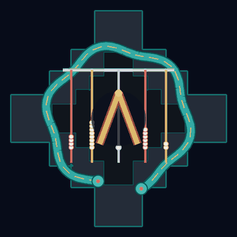
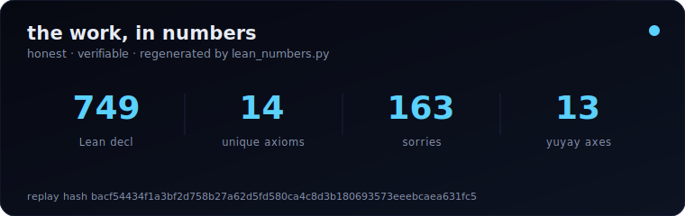

<!--
  Personal profile README — stephenlutar2-hash/stephenlutar2-hash
  Doctrine v11. No marketing superlatives. Every number verifiable against lutar-lean@main.
  Last substantive update: 2026-06-01 (Series-A alignment with Hugging Face + killinchu flagship)
  Canonical numbers: 749 declarations / 14 unique axioms / 163 sorries — source of truth:
  https://github.com/szl-holdings/.github/blob/main/.github/data/lean_numbers.json
-->

<div align="center">

<!-- Inca avatar (Amaru) inline mark · additive · Yachay · 2026-06-01.
     Small 180px mark; Provenanced Notebook and all sections below untouched. -->


# Stephen P. Lutar Jr.

### Founder & CEO, SZL Holdings — formally-verified governance substrate for agentic AI

</div>

<div align="center">

<!-- genius-hero (Doctrine v11) · let the work speak -->
<a href="https://stephenlutar2-hash.github.io/stephenlutar2-hash/"></a>

<b><a href="https://stephenlutar2-hash.github.io/stephenlutar2-hash/">▶ Walk the live 3D build timeline</a></b>  ·  <b><a href="https://szl-holdings.github.io/.github/">▶ Open the live SZL constellation</a></b>

</div>

<!-- PURIQ governance functional — renders natively in GitHub LaTeX -->
$$\Lambda(x) \;=\; \sum_{i=1}^{13} w_i\,\phi_i(x), \qquad \sum_{i=1}^{13} w_i = 1,\quad w_i \ge 0, \qquad \texttt{receipts.in} \equiv \texttt{receipts.out}$$

<div align="center"><sub>The 13-axis <code>yuyay_v3</code> aggregator. A2 = <code>IsHomogeneous</code>, A4 = <code>IsBounded</code>. Λ-uniqueness is <a href="https://github.com/szl-holdings/lutar-lean">Conjecture 1</a>, not a closed theorem.</sub></div>

```lean
-- theorem of the week · machine-checked in lutar-lean@main
theorem lambda_bounded (x : ReceiptBus) : ‖Λ x‖ ≤ 1 := by
  simpa using isBounded_lambda x   -- A4 : IsBounded
```

<div align="center">

> *Math + story together. No mysticism.* — **Yachay**

</div>


> ### ◆ [**The Provenanced Notebook**](https://www.perplexity.ai/computer/a/stephen-lutar-the-provenanced-_PQEUZ3zTKG.pfgCyepiTQ) — my live personal site
> Not a résumé — the inside of the workshop. The PURIQ formula **computes** live, a theorem **re-checks** in a Lean kernel, and **your visit mints a Khipu receipt**. This README is just the gateway; the thinking happens there.

<p align="center">
  <a href="https://orcid.org/0009-0001-0110-4173"></a>
  <a href="https://www.linkedin.com/in/stephen-l-279315240/"></a>
  <a href="https://huggingface.co/SZLHOLDINGS"></a>
  <a href="https://doi.org/10.5281/zenodo.19944926"></a>
  <a href="https://github.com/szl-holdings/.github/blob/main/DOCTRINE_V11.md"></a>
  <a href="https://slsa.dev/spec/v1.0/levels"></a>
</p>

---

## What I build

**[SZL Holdings](https://github.com/szl-holdings)** is a formally-verified governance substrate for agentic AI. The Λ aggregator is anchored in Lean 4 + Mathlib, and every gate decision emits a DSSE-enveloped receipt onto a hash-linked Khipu Merkle DAG — packaged as a UDS-deployable bundle and aligned with EU AI Act Article 12 and NIST AI RMF.

Building in public: org at [github.com/szl-holdings](https://github.com/szl-holdings) · live demos on [🤗 Hugging Face](https://huggingface.co/SZLHOLDINGS).

---

## Substrate at a glance (honest, verifiable)

| Metric | Value | Source |
|---|---|---|
| Lean 4 declarations | **749** | [`lutar-lean@main`](https://github.com/szl-holdings/lutar-lean) |
| Unique axioms | **14** (15 raw, 1 duplicate) | [`lean_numbers.json`](https://github.com/szl-holdings/.github/blob/main/.github/data/lean_numbers.json) |
| Tracked sorries | **163** (112 baseline + 51 Putnam) | regenerated by `lean_numbers.py` |
| Λ uniqueness | **Conjecture** (open CAUCHY_ND sorry + missing symmetry axiom) | not a closed theorem |
| HF Spaces (live) | **10** | [SZLHOLDINGS](https://huggingface.co/SZLHOLDINGS) |
| Org public repos | **19** | [szl-holdings](https://github.com/szl-holdings) |
| Supply-chain posture | **SLSA L1 (honest)** | not L3; receipt sigs = `PLACEHOLDER` until Sigstore CI |

> I do **not** claim "zero sorry" or "fully verified." The Λ uniqueness result is a Conjecture. Every number above regenerates from `lutar-lean@main`.

---

## Pinned repositories

| Repo | What it is |
|---|---|
| [`szl-holdings/ouroboros`](https://github.com/szl-holdings/ouroboros) | Bounded-recursion runtime · Λ-gate · receipt emission |
| [`szl-holdings/a11oy`](https://github.com/szl-holdings/a11oy) | Brand orchestration — policy + receipt substrate |
| [`szl-holdings/lutar-lean`](https://github.com/szl-holdings/lutar-lean) | Lean 4 + Mathlib kernel · 749 decl / 14 axioms / 163 sorries |
| [`szl-holdings/killinchu`](https://github.com/szl-holdings/killinchu) | Drone intelligence — counter-UAS rule engine *(NEW)* |
| [`szl-holdings/ouroboros-thesis`](https://github.com/szl-holdings/ouroboros-thesis) | DOI-pinned written thesis |

---

## Flagship surfaces (live on 🤗)

- 🛡️ **[a11oy](https://huggingface.co/spaces/SZLHOLDINGS/a11oy)** — brand orchestration layer
- 🧠 **[amaru](https://huggingface.co/spaces/SZLHOLDINGS/amaru)** — cortex / conduit
- 🦠 **[sentra](https://huggingface.co/spaces/SZLHOLDINGS/sentra)** — immune / policy
- 🦅 **[killinchu](https://huggingface.co/spaces/SZLHOLDINGS/killinchu)** — drone intelligence (air sibling of [vessels](https://huggingface.co/spaces/SZLHOLDINGS/vessels))
- 🪢 **[rosie](https://huggingface.co/spaces/SZLHOLDINGS/rosie)** — cross-session memory
- 🧬 **[anatomy-3d](https://szlholdings-anatomy-3d.static.hf.space/)** · **[rosie-3d](https://szlholdings-rosie-3d.static.hf.space/)** — interactive 3D substrate

---

## Research — DOI-pinned

The thesis chain runs **v14 → v20**; every claim terminates in a DOI, a commit SHA, a Lean theorem, or a CI run. Concept DOI (always latest): [`10.5281/zenodo.19944926`](https://doi.org/10.5281/zenodo.19944926).

| Version | DOI |
|---|---|
| v18.0 (master) | [`10.5281/zenodo.20434276`](https://doi.org/10.5281/zenodo.20434276) |
| v18.0.0 (software) | [`10.5281/zenodo.20434308`](https://doi.org/10.5281/zenodo.20434308) |
| v17 | [`10.5281/zenodo.20431181`](https://doi.org/10.5281/zenodo.20431181) |
| v16 | [`10.5281/zenodo.20424996`](https://doi.org/10.5281/zenodo.20424996) |
| v15 | [`10.5281/zenodo.20424995`](https://doi.org/10.5281/zenodo.20424995) |
| v14 | [`10.5281/zenodo.20424992`](https://doi.org/10.5281/zenodo.20424992) |
| v11 (applied) | [`10.5281/zenodo.20119582`](https://doi.org/10.5281/zenodo.20119582) |
| v3 (Lutar Invariant) | [`10.5281/zenodo.19983066`](https://doi.org/10.5281/zenodo.19983066) |
| v1 (position) | [`10.5281/zenodo.19867281`](https://doi.org/10.5281/zenodo.19867281) |

---

## Building in public

I ship the governance substrate in the open and post progress as it lands.

- **LinkedIn:** [@stephen-l-279315240](https://www.linkedin.com/in/stephen-l-279315240/) — build log + Series-A narrative
- **Hugging Face:** [SZLHOLDINGS](https://huggingface.co/SZLHOLDINGS) — 10 live Spaces
- **ORCID:** [0009-0001-0110-4173](https://orcid.org/0009-0001-0110-4173) — verified research identity
- **Zenodo:** [communities/szl-holdings](https://zenodo.org/communities/szl-holdings) — DOI-pinned thesis chain

---

## Stack

**Languages:** TypeScript · Python · Lean 4 · Bash
**Runtime:** Node.js 24 · pnpm · React · Vite · FastAPI
**Data:** PostgreSQL · Drizzle ORM · Redis · pgvector
**Supply chain:** Sigstore · Zenodo · CodeQL · Trivy · Gitleaks · OpenSSF Scorecard · SBOM
**Observability:** OpenTelemetry · Λ-axis spans (13-axis schema)

<p align="center">
  
</p>

---

## Contact

**Stephen P. Lutar Jr.** — Founder & CEO, SZL Holdings

| | |
|---|---|
| Email | [`stephen@szlholdings.com`](mailto:stephen@szlholdings.com) |
| ORCID | [`0009-0001-0110-4173`](https://orcid.org/0009-0001-0110-4173) |
| LinkedIn | [stephen-l-279315240](https://www.linkedin.com/in/stephen-l-279315240/) |
| Hugging Face | org [SZLHOLDINGS](https://huggingface.co/SZLHOLDINGS) |
| Web | [`szlholdings.com`](https://szlholdings.com) |
| Security | [`security@szlholdings.com`](mailto:security@szlholdings.com) · [policy](https://github.com/szl-holdings/.github/security/policy) |

---

<sub>© 2026 Stephen P. Lutar Jr. · Code: Apache-2.0 · Research: CC BY 4.0 · Doctrine v11 · Every count and DOI on this page is verifiable against <a href="https://github.com/szl-holdings/lutar-lean">lutar-lean@main</a>. Λ uniqueness is a Conjecture; SLSA L1 honest.</sub>
