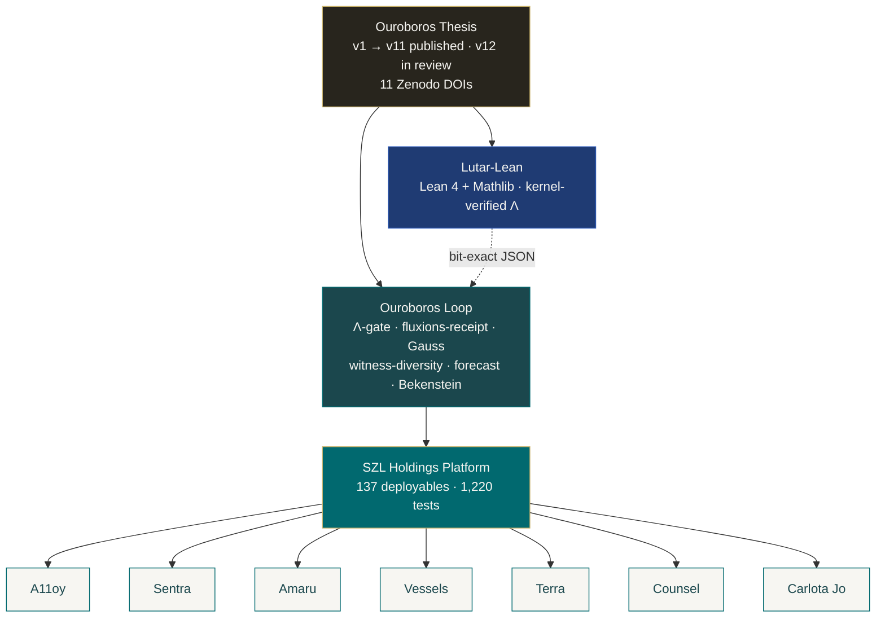
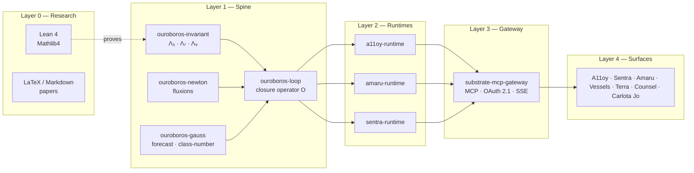

<!--
  Personal profile README — stephenlutar2-hash/stephenlutar2-hash
  Style: researcher-founder. Hydra Teal brand. No emojis.
  Every number on this page is verifiable. See /assets and audit logs.
-->

# Stephen P. Lutar Jr.

> Founder & CEO, [SZL Holdings](https://github.com/szl-holdings).
> Building **governed decision intelligence** for regulated enterprises — AI that is auditable by construction, not by promise.

  
  
  
  
  
  
  
  
  

---

## What I build

**[SZL Holdings](https://github.com/szl-holdings)** — a governed operational-intelligence stack for regulated enterprises. Seven vertical operator surfaces, one spine, one set of papers.

| Layer | What it is | Status |
|---|---|---|
| [Ouroboros Thesis](https://github.com/szl-holdings/ouroboros-thesis) | Canonical papers v1 → v11, DOI lineage, every formula bound to running code | v11 published · v12 PR #25 open · v13 in writing |
| [Lutar-Lean](https://github.com/szl-holdings/lutar-lean) | Lean 4 + Mathlib formalisation of the Lutar Invariant Λ_k uniqueness theorem | Kernel builds clean · ref-vectors check in CI |
| [Ouroboros Loop](https://github.com/szl-holdings/szl-holdings-platform/tree/main/packages/ouroboros-loop) | Closure operator `O : X → X` with Λ-gate, Gauss forecast, witness-diversity, Bekenstein, dual-witness | 19/19 tests · published bit-exact ref-vectors |
| [Platform monorepo](https://github.com/szl-holdings/szl-holdings-platform) | TypeScript spine + 7 surfaces + workers + apps + services | **1,220 tests across 76 packages · 0 failures** |
| [MCP gateway](https://github.com/szl-holdings/szl-holdings-platform/tree/main/services/substrate-mcp-gateway) | Streamable HTTP, SSE, OAuth 2.1, extension negotiation | **27/27 e2e tests** including session lifecycle + extension RPC |

---

## Mechanisms (what's load-bearing)

Each mechanism has a paper, a Lean-side proof obligation, and a TypeScript implementation with tests. Every link below points to running, verifiable code.

| # | Mechanism | Paper | Lean | TypeScript |
|---|---|---|---|---|
| I | Λ-invariant family (Λ₅ / Λ₇ / Λ₉) | [v3](https://doi.org/10.5281/zenodo.19983066), [v9](https://doi.org/10.5281/zenodo.20053148), [v10](https://doi.org/10.5281/zenodo.20053163) | [`Lutar/Invariant.lean`](https://github.com/szl-holdings/lutar-lean/blob/main/Lutar/Invariant.lean), [`Lutar/Bound.lean`](https://github.com/szl-holdings/lutar-lean/blob/main/Lutar/Bound.lean) | [`@workspace/ouroboros-invariant`](https://github.com/szl-holdings/szl-holdings-platform/tree/main/packages/ouroboros-invariant) · 52/52 tests |
| II | Newton fluxions-receipt | [v4 §3](https://doi.org/10.5281/zenodo.20020841) | (sketch) | [`@workspace/ouroboros-newton`](https://github.com/szl-holdings/szl-holdings-platform/tree/main/packages/ouroboros-newton) · 29/29 |
| III | Gauss class-number witness-diversity | v12 (in review), v13 (in writing) | (in progress) | [`@workspace/ouroboros-gauss`](https://github.com/szl-holdings/szl-holdings-platform/tree/main/packages/ouroboros-gauss) · 64/64 |
| IV | Gauss least-squares forecast | v12 | — | `ouroboros-loop.gaussForecast` |
| V | Bekenstein-bounded cascade | v4, v6, v12 | — | `lutar-formulas.bekenstein` |
| VI | Dual-witness verdict | v2, v12 | — | `@workspace/ouroboros-adapters` |

All six mechanisms compose inside [`@workspace/ouroboros-loop`](https://github.com/szl-holdings/szl-holdings-platform/tree/main/packages/ouroboros-loop) as a single closure operator `O : X → X` with a SHA-256 receipt for every terminal verdict.

---

## Products on the platform

Seven vertical operator surfaces. Each consumes the same Ouroboros loop spine.

| Surface | Domain | Repo | Runtime status |
|---|---|---|---|
| **A11oy** | Brand orchestration & AI governance | [`a11oy`](https://github.com/szl-holdings/a11oy) | [`a11oy-runtime`](https://github.com/szl-holdings/szl-holdings-platform/tree/main/packages/a11oy-runtime) · 32/32 tests |
| **Sentra** | Cyber resilience command | [`sentra`](https://github.com/szl-holdings/sentra) | [`sentra-runtime`](https://github.com/szl-holdings/szl-holdings-platform/tree/main/packages/sentra-runtime) · 21/21 tests |
| **Amaru** | Convergent data sync (Andean ouroboros) | [`amaru`](https://github.com/szl-holdings/amaru) | [`amaru-runtime`](https://github.com/szl-holdings/szl-holdings-platform/tree/main/packages/amaru-runtime) · 12/12 tests |
| **Vessels** | Maritime fleet intelligence | [`vessels`](https://github.com/szl-holdings/vessels) | v1.0.0-alpha |
| **Terra** | Real-estate intelligence | [`terra`](https://github.com/szl-holdings/terra) | v1.0.0-alpha |
| **Counsel** | Legal matter command | [`counsel`](https://github.com/szl-holdings/counsel) | v1.0.0-alpha |
| **Carlota Jo** | UHNW advisory operations | [`carlota-jo`](https://github.com/szl-holdings/carlota-jo) | v1.0.0-alpha |

---

## Research

11 published papers + 1 in review + 1 in writing, every claim bound to running TypeScript and (where applicable) machine-verified Lean.

| # | Title | DOI |
|---|---|---|
| v13 | The Unified Ouroboros Spine *(in writing)* | — |
| v12 | The Λ-Ouroboros Substrate — Four Machine-Verified Mechanisms *(PR #25 open)* | — |
| v11 | APPLIED-Λ — Measured per-request overhead of the audit-closure operator | [`10.5281/zenodo.20119582`](https://doi.org/10.5281/zenodo.20119582) |
| v10 | EXHAUSTIVE-AUDIT — Audit Closure Operator Λ₁₀ | [`10.5281/zenodo.20053163`](https://doi.org/10.5281/zenodo.20053163) |
| v9 | UNIFIED-OPERATIONAL — Lutar family v1→v7 + Ω with Bianchi closure | [`10.5281/zenodo.20053148`](https://doi.org/10.5281/zenodo.20053148) |
| v8 | Free-Energy Active Inference + Predictive Coding + Cognitive Maps | [`10.5281/zenodo.20020849`](https://doi.org/10.5281/zenodo.20020849) |
| v7 | Sefirot Memory + Hopfield Associative Retrieval | [`10.5281/zenodo.20020848`](https://doi.org/10.5281/zenodo.20020848) |
| v6 | Hermetic Safety + Chinchilla-Lutar Scaling + Bifurcation | [`10.5281/zenodo.20020845`](https://doi.org/10.5281/zenodo.20020845) |
| v5 | Prisca-GraphRAG + Tawa SAE Interpretability | [`10.5281/zenodo.20020846`](https://doi.org/10.5281/zenodo.20020846) |
| v4 | Omega Formalism + EPR-Bell + Sacred Geometry | [`10.5281/zenodo.20020841`](https://doi.org/10.5281/zenodo.20020841) |
| v3 | The Lutar Invariant — axiomatic trust aggregator | [`10.5281/zenodo.19983066`](https://doi.org/10.5281/zenodo.19983066) |
| v2 | Empirical companion — A11oy / Sentra / Amaru case studies | [`10.5281/zenodo.19934129`](https://doi.org/10.5281/zenodo.19934129) |
| v1 | Position paper — bounded looped computation | [`10.5281/zenodo.19867281`](https://doi.org/10.5281/zenodo.19867281) |

**Concept DOI** [`10.5281/zenodo.19944926`](https://doi.org/10.5281/zenodo.19944926) always resolves to the latest version.

### What this work claims and does not claim

- ✅ A Lean-kernel proof that `Λ_k(x) = (∏ xᵢ)^(1/k)` is the unique aggregator satisfying axioms A1–A4 (monotone · homogeneous · Egyptian-exact · bounded). [Source](https://github.com/szl-holdings/lutar-lean/blob/main/Lutar/Uniqueness.lean).
- ✅ Bit-exact reproduction of Λ₉ on 10 published golden vectors across **three production runtimes** (a11oy / amaru / sentra) and the Lean Float implementation. [Reference vectors](https://github.com/szl-holdings/szl-holdings-platform/blob/main/packages/ouroboros-invariant/reference-vectors/reference-vectors.json).
- ✅ Measured per-request overhead of the audit-closure operator across 24,800 paired HTTP calls (v11 paper).
- ❌ Not a quantum computer. The quantum modules use the math of quantum analogy to derive bounds, on classical hardware.
- ❌ Not a free-energy device. The free-energy term is Friston variational FEP, not thermodynamic free energy.
- ❌ Not perpetual inference. The "free tokens" framing in marketing decks is shorthand for "calls refused before they hit a paid provider"; nothing is generated for free.

---

## Engineering principles

- **Determinism over plausibility.** Loops are bounded with measurable convergence; outputs carry SHA-256 audit closure.
- **Supply-chain hygiene as a feature.** SHA-pinned actions, harden-runner egress policy, signed releases (sigstore/cosign), SBOM on every build, OpenSSF Scorecard tracked publicly.
- **Falsifiability.** Every paper has a *how this could be wrong* section. Every claim has a test or a Lean proof obligation.
- **One spine, many surfaces.** Vertical surfaces share infrastructure, governance, and provenance.

---

## Stack & tooling

**Languages.** TypeScript · Python · Lean 4 · Bash
**Runtime.** Node.js 24 · pnpm 10 · React · Vite
**Data.** PostgreSQL (Neon) · Drizzle ORM · Redis · pgvector
**Cloud.** Hetzner · Cloudflare · Sigstore · Zenodo
**Quality.** Vitest · Playwright · CodeQL · Trivy · Gitleaks · OpenSSF Scorecard · Lean kernel
**Observability.** OpenTelemetry · Pino · PM2

---

## Activity

  
  

---

## Contact

**Stephen P. Lutar Jr.** — Principal · SZL Holdings
[`stephen@szlholdings.com`](mailto:stephen@szlholdings.com) · [ORCID `0009-0001-0110-4173`](https://orcid.org/0009-0001-0110-4173) · [LinkedIn](https://linkedin.com/in/stephen-l-279315240) · [`szlholdings.com`](https://szlholdings.com)

For security disclosures, see the [SZL Holdings security policy](https://github.com/szl-holdings/.github/security/policy) or email `security@szlholdings.com`.

© 2026 Stephen P. Lutar Jr. — Code released under Apache-2.0. Research released under CC BY 4.0. Every test count on this page is verifiable; see the linked audit logs and reference-vectors.json.
